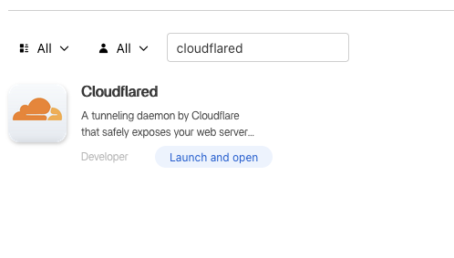
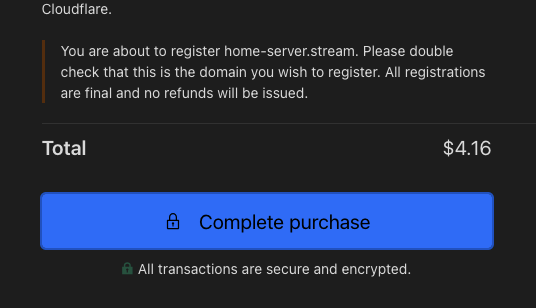
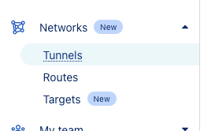
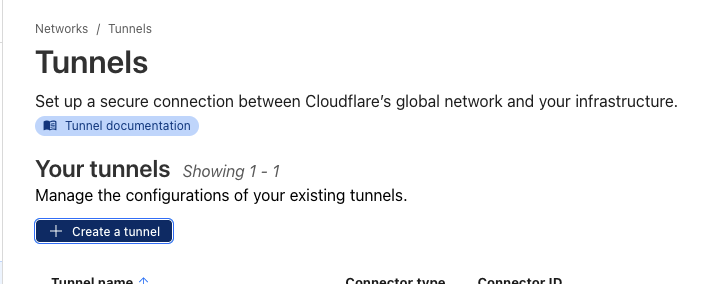
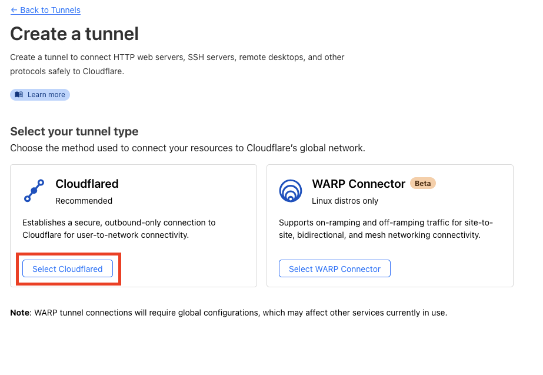
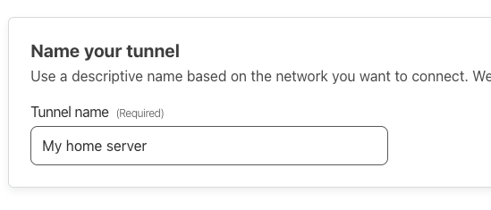
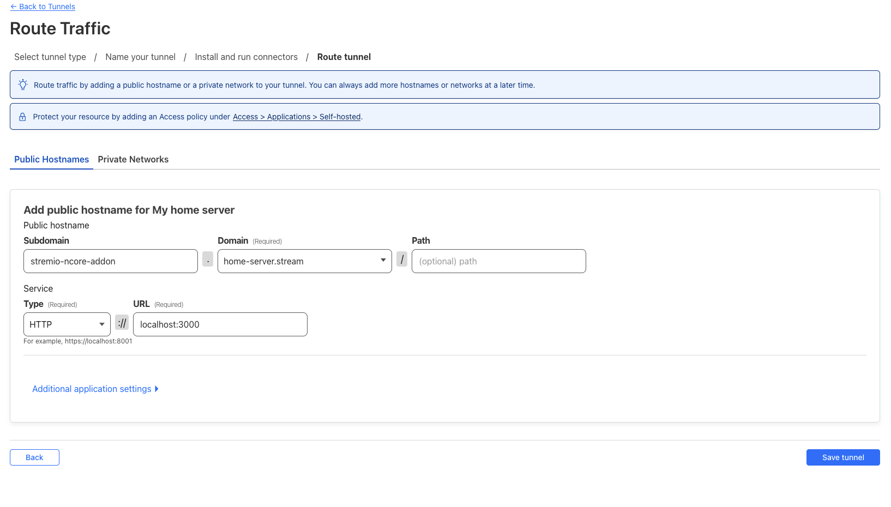

# Beginner installation guide

This installation guide will guide you through the recommended installation process for beginners.

If you are not experienced with selfhosting, then this is the guide for you.

> [!IMPORTANT]
>
> This guide requires you to get a domain name, which you need to pay an annual fee for.
> This is the only way you can access your addon from outside of your home and share it with friends or family.
>
> If you don't need that, you can also read the [Local only](./local-only.md) guide, which doesn't require you to buy a domain.
>
> You can change your mind later and switch between the two.

## Step 1 - Set up a server

You need to have a server that will download and stream the content for you. Don't worry, you don't need anything fancy, an old PC or a Raspberry Pi will be perfectly fine.

First, you need to install Linux on this computer.

If you have a Raspberry pi, then I recommend following [this guide](https://www.raspberrypi.com/documentation/computers/getting-started.html).

If you are using a regular PC as your server, then I recommend installing Ubuntu through [this guide](https://ubuntu.com/tutorials/install-ubuntu-desktop).

## Step 2 - Install CasaOS

Once you have your server set up correctly and it is connected to your router, it's time to install CasaOS on it.

Open the terminal on your server machine.

Type the following command into the terminal:

```sh
curl -fsSL https://get.casaos.io | sudo bash
```

It might ask you for your password (If you type in your password, but nothing changes on the screen, don't worry, things are still happening, the system is simply hiding your password).

I recommend watching this [video by BigBearTechWorld](https://youtu.be/aNjMFI3e-14?si=ZbRi1jnYueBdAePU&t=188) if you would like a video guide.

## Step 3 - Install Cloudflared from the App Store

Open the CasaOS App Store.


Search for Cloudflared



Click install, then open Cloudflared.

### 3.1 Create a Cloudflare account and register a domain

In a new browser tab, open cloudflare and create an account (or log in if you already have one).

Once you are logged in, go to **Domain registration** ➡️ **Register Domains**.


Search for a domain name that you like (Tip: some domain names are cheaper than others, so look for something that you are comfortable paying for each year. Don't forget to check the renewal price too.)


Provide your details and complete the purchase.



### 3.2 Create a Cloudflare tunnel

Click on **Zero Trust** in the Cloudflare sidebar.


Inside the **Cloudflare Zero Trust** dashboard, click on **Networks** ➡️ **Tunnels**.



Click on **Create a tunnel**.



Select **Cloudflared**.



Name your tunnel according to your preferences.



On the **Configure** page, click on **Windows**, then copy the command.


Go back to the **Cloudflared** tab, paste the command into the **Tunnel Connector Token** textbox. Remove the unnecessary command keywords at the beginning to only leave the token itself. Click on **Save** and **Start**.

<video src="https://raw.githubusercontent.com/detarkende/stremio-ncore-addon/master/docs/installation-guides/beginners/assets/cloudflare-delete-command.mp4" aria-label="Paste command and remove commands to only leave the token in place" />

You can close **Cloudflared** now, but don't close **Cloudflare Zero Trust**.

## Step 4 - Install Stremio nCore addon in CasaOS.

Back on the CasaOS Dashboard, click the Plus icon and add a customized app.

Click on the import button, then import the following configuration text.

<details>
<summary>View config text</summary>

```yml
name: stremio-ncore-addon
services:
  stremio-ncore-addon:
    environment:
      - NCORE_PASSWORD=
      - NCORE_USERNAME=
    image: detarkende/stremio-ncore-addon:0.6.0
    ports:
      - target: 3000
        published: '3000'
        protocol: tcp
    restart: unless-stopped
    volumes:
      - type: bind
        source: /DATA/AppData/stremio-ncore-addon
        target: /addon
x-casaos:
  icon: https://github.com/detarkende/stremio-ncore-addon/blob/master/client/public/stremio-ncore-addon-logo-rounded.png?raw=true
  scheme: https
  title:
    custom: Stremio nCore addon
```

</details>

Click submit, then fill the App settings.

<video src="https://raw.githubusercontent.com/detarkende/stremio-ncore-addon/master/docs/installation-guides/beginners/assets/casaos-install-addon.mp4" aria-label="Install the addon" />

## Step 5 - Setup the addon in your local network

Go to the addon to configure the settings.

If your CasaOS page is running on `http://192.168.1.167`, then your addon is running at `http://192.168.1.167:3000`.

You should see the installation wizard here.

[Follow this guide to finish the setup.](../addon-settings/addon-settings.md)

If you bought the domain `my-homelab.me`, then your **Addon URL** will be `https://stremio-ncore-addon.my-homelab.me`.

## Step 6 - Finalize your addon URL

Once **Cloudflared** is running, you can click "Next" in the **Cloudflare Zero Trust** dashboard.

This will prompt you to create a public hostname.

Fill out the details in the following way:



(Of course you should select your own domain in the dropdown).

## You're done! 🎉

The addon is now running at your Addon URL. You should now check out the Client Setup Guide to know how to add the addon to your TV / media device.
